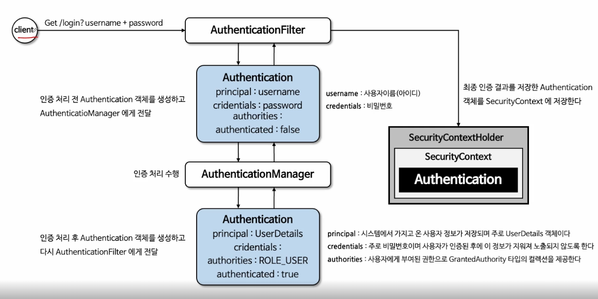

# Authentication

## Authentication 이란?

* 특정 자원에 접근하려는 사람의 신원을 확인하는 방법
  * 시스템에 저장되어 있는지/없는지 확인 (인증) -> 신원을 확인한 후에 권한 부여 (인가)
* 인증 이후에 spring security에 저장된다
* getPrincipal
  * 인증 주체를 의미한다
  * 인증 요청의 경우 사용자 이름. 인증 후에는 userDatails 타입의 객체가 될 수 있다
* getCredentials
  * 대게는 비밀번호가 저장되어 있음, 인증 후에는 보안상 null일 가능성이 높다
* getAuthorities
  * 인증 주체에게 부여된 권한
* getDetails
  * 인증 요청에 대한 추가적인 세부사항들 - IP, 인증서 일련번호 등
* isAuthenticated
  * 인증상태를 반환한다
* serAuthenticated
  * 인증 상태를 설정한다

## 인증절차 흐름

* 클라이언트 요청 (user name 과 password와 함께)
* AuthenticationFilter는 Authentication 객체를 만든다
  * 권한 여부 false 상태로
* AuthenticationManager에게 전달되어서 인증처리를 수행한다 수행 후 새로운 Authentication 생성
  * 권한여부 ture 상태로
* 인증 받은 Authentication은 SecurityContextHolder를 통해 SecurityContext에 저장된다
