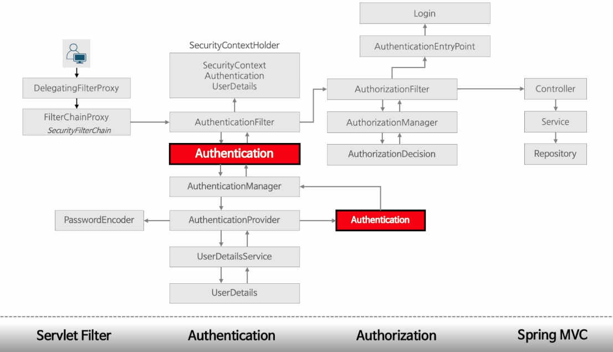

# 인증 / 인가 흐름

<figure><figcaption></figcaption></figure>

* Servlet Filter
  * 사용자 요청이 들어온다
  * 요청이 들어오면 Delegating Filter Proxy가 요청을 Spring container로 넘긴다
    * Delegating Filter Proxy - Spring의 서블릿 필터 체인에서 동작하는 프록시로 시큐리티 필터를 호출하는 역할
  * Delegating Filter Proxy가 가지고 있는 여러 Spring Security 필터들을 호출하면서 사용자 요청을 처리한다
  * Delegating Filter Proxy가 사용자 요청을 처리한 후 인증 필터를 호출한다
* Authetication
  * AuthenticationFilter가 요청을 받은 후 사용자의 입력을 기반으로 Authetication 객체를 만들음
  * AuthenticationManager
    * 전달받은 Authentication 객체의 인증을 시도한다
    * AuthenticationProvider에게 역할 위임
  * AuthenticationProvider
    * 실질적으로 처리되는 부분
    * 전달받은 UserDatails과 비교해서 맞으면 Authetication을 생성한다
      * password encoder를 통해서 비밀번호 확인
  * UserDatailsService
    * DB에서 사용자 정보를 가져온다
    * 유저 정보는 UserDetails으로 반환된다
  * UserDatails
    * 유저 정보가 담긴 타입
  * SecurityContextHolder
    * SecurityContext에 유저 정보를 저장하도록 도와준다
      * 인증에 성공한 유저 정보가 들어 있는 Authentication객체가 security context에 저장된다
        * 유저 정보는 UserDetails 타입

\
